Aplicacion de Ecommerce de articulos para mascotas, cada vista esta diseñada para una facil interaccion con el usuario final y con los colores identificativos de nuestra marca.

**VISTA INICIO**

En esta vista tenemos 3 opciones, iniciar sesion, crear cuenta o entrar como invitado con una interaccion mucho menor que con una cuenta.

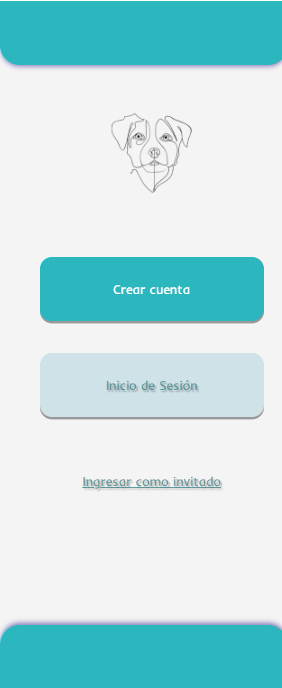

**VISTA LOGIN**

Aqui tenemos la capacidad de iniciar sesion por medio de la API de google (por implementar) o de Apple (por implementar), o de recuperar nuestra contraseña por medio de correo electronico (por implementar) y de registrarnos

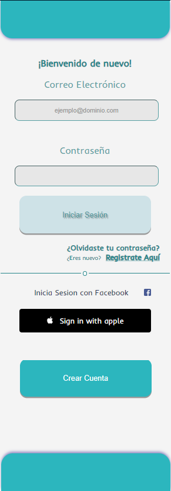

**VISTA REGISTRO**

Aqui tenemos una pagina de registro normal, conectada directamente con la base de datos mongodb.

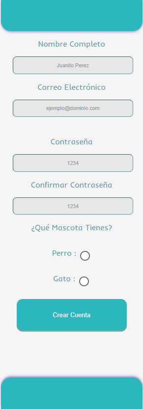

**VISTA HOME**

Aqui tenemos una pantalla de inicio tipo ecommerce donde podemos buscar por medio del search-box especificamente lo que estamos buscando (por implementar), o explorar cada una de las categorias y tambien podemos navegar entre paginas Inicio, Compras, Promociones y cuenta, como tambien ver el carrito de compras (por implementar).

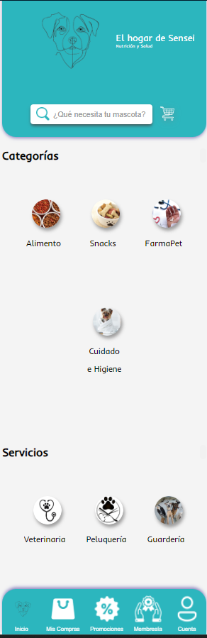

**VISTA COMPRAS**

(por implementar)

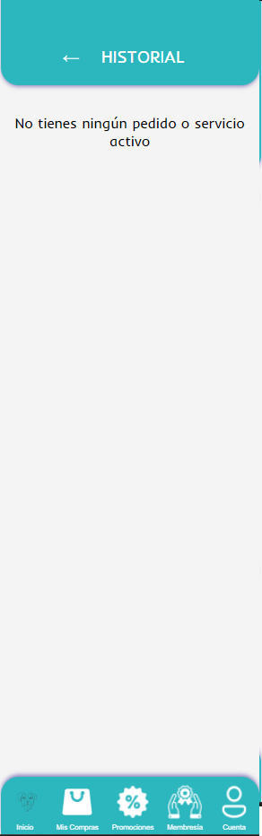

**VISTA PROMOCIONES**

(por implementar)

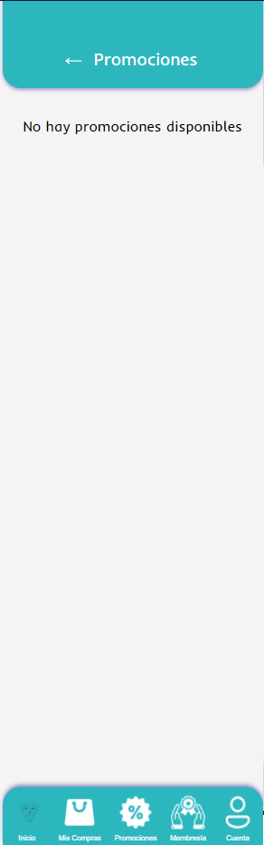

**VISTA MEMBRESIA**

Aqui tenemos una breve descripcion de que incluye nuestra membresia junto con el precio y un boton de pago (por implementar).

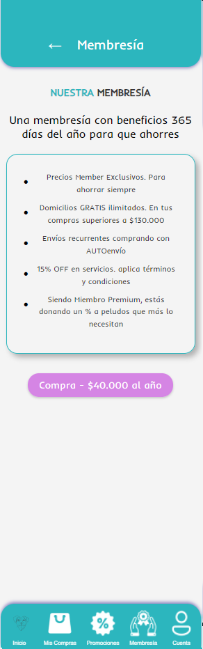

**VISTA CUENTA**

Aqui tenemos una vista general de nuestra cuenta, donde podemos agregar detalles de direccion para poder realizar envios, manejar la membresia (por implementar), ver el historial de pedidos (por implementar), y cerrar sesión.

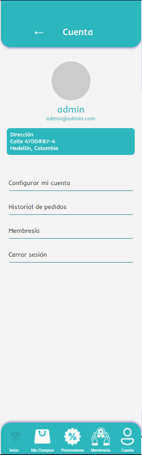

**VISTA MENU CONFIGURACION DIRECCION CUENTA**

Aqui tenemos un pequeño menu tipo pop-up donde podemos agregar detalles de la direccion que se almacena directamente en la base de datos de mongodb.

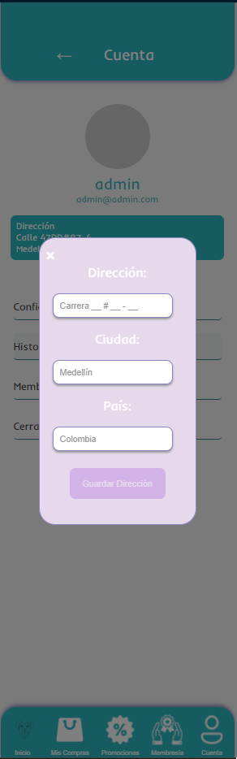

**VISTA CATALOGO**

Aqui tenemos un pequeño catalogo por cada una de las categorias (en la imagen se muestra solo una de referencia), donde estan divididos alfabeticamente por marcas con un scroll y una funcionalidad de seleccionar por la letra de la marca que quieras para ir directamente a la categoria alfabetica que desees. (por terminar de implementar)

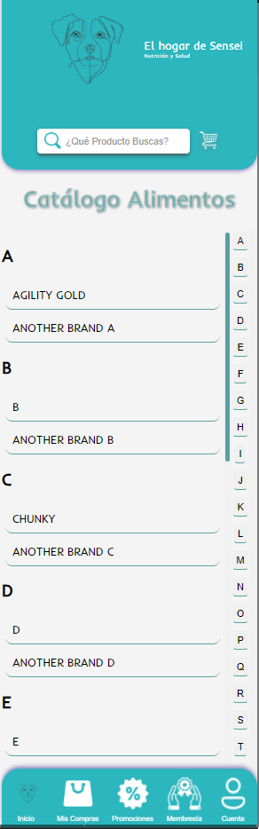

**VISTA PRODUCTO**

Aqui tenemos una breve implementacion de una pagina de producto, donde seleccionas la marca que quieres, y el producto que quieras, donde te muestra la informacion del producto (codigo de barras, codigo interno, descripcion, precio) y un boton de agregar al carrito (por implementar)

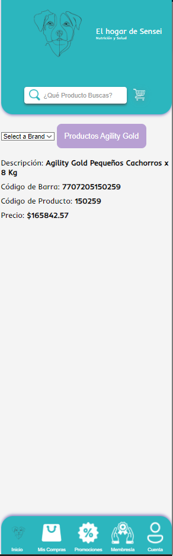
